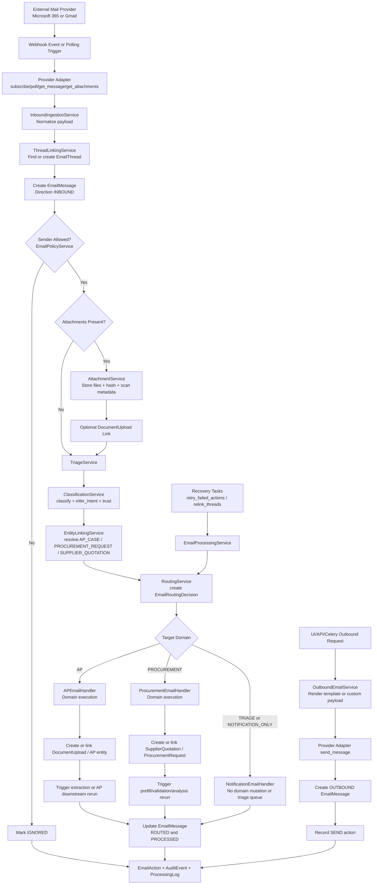

# Email Integration Flow Chart

## Notes
- Shared channel stops at normalization, triage, linking, routing, and governed actions.
- Business execution remains domain-specific (AP vs Procurement).
- Every mutation path records action and audit metadata.
